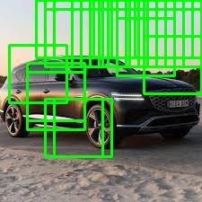
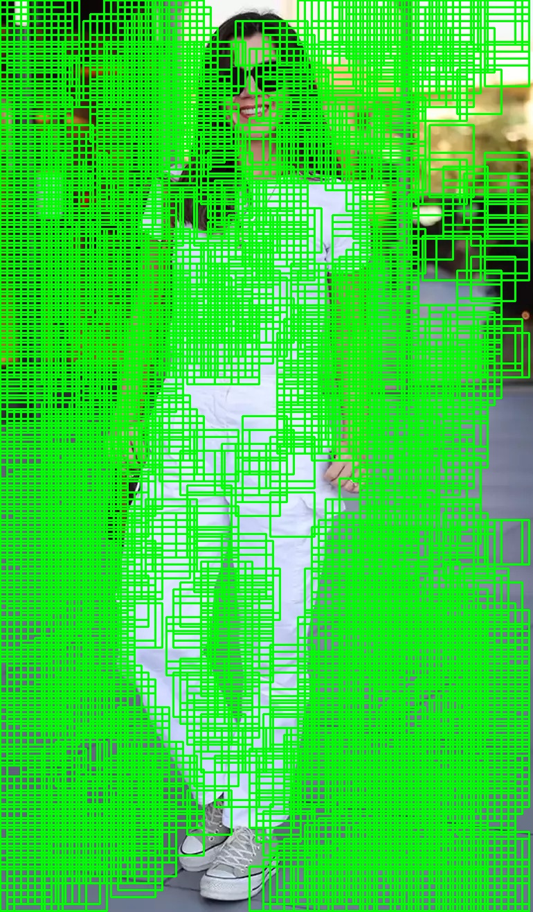

# 🚗 Histogram of Oriented Gradients (HOG) & SVM ile Nesne Tespiti


> **Bu proje, klasik bilgisayarlı görü tekniklerini (HOG + SVM) kullanarak araç ve yaya tespiti yapan uçtan uca bir sistemdir.**

---

## 📖 Proje Hakkında

Günümüzde otonom sürüş ve güvenlik sistemlerinin temelini oluşturan **Nesne Tespiti (Object Detection)** problemi, bu projede derin öğrenme yöntemlerine alternatif olarak, daha düşük donanım kaynağı gerektiren klasik yöntemlerle çözülmüştür.

**Projenin temel amacı:**
1.  **HOG (Histogram of Oriented Gradients)** algoritması ile görüntüden şekil/kenar özniteliklerini çıkarmak.
2.  **SVM (Support Vector Machine)** algoritması ile bu öznitelikleri "Araç" veya "Araç Değil" olarak sınıflandırmak.
3.  **Kayan Pencere (Sliding Window)** yöntemi ile test görüntüsü üzerinde gezerek nesneleri tespit etmek.

---

## 📸 Proje Sonuçları ve Görseller

Proje kapsamında elde edilen deneysel sonuçlar aşağıda sunulmuştur.

### 1. HOG Öznitelik Görselleştirmesi
HOG algoritmasının bir aracı nasıl "gördüğünü" analiz ettik. Gradyanlar, aracın tekerlek ve tavan yapısını net bir şekilde ortaya çıkarmaktadır.


*(Sol: Orijinal Görüntü | Sağ: HOG Gradyan Temsili)*

### 2. Araç Tespiti Sonucu
Eğitilen özel SVM modeli, daha önce hiç görmediği bir test görüntüsü üzerinde aracı başarıyla tespit etmiştir.



### 3. İnsan (Yaya) Tespiti Sonucu
Sistem aynı zamanda yayaları tespit etmek için de test edilmiştir.



---

## 🛠️ Kullanılan Teknolojiler ve Kütüphaneler

Bu proje **Python** dili ile geliştirilmiştir. Kullanılan temel kütüphaneler:

* 🐍 **OpenCV:** Görüntü işleme ve çizim işlemleri.
* 🔢 **NumPy:** Matris ve vektör hesaplamaları.
* 🧠 **Scikit-learn:** SVM modelinin eğitimi ve metrikler.
* 👁️ **Scikit-image:** HOG algoritmasının implementasyonu.
* 💾 **Joblib:** Eğitilen modelin kaydedilmesi.
* 📊 **Matplotlib:** Sonuçların görselleştirilmesi.

---

## 📂 Proje Yapısı

```text
├── data/
│   ├── training_set/       # Eğitim için kullanılan 100+ resim (Pos/Neg)
│   ├── test_images/        # Test edilen ham görüntüler
│   └── results/            # İşlenmiş ve kutu çizilmiş sonuçlar
├── src/
│   ├── hog_implementation.py  # HOG görselleştirme kodu
│   ├── classification.py      # SVM model eğitimi kodu
│   ├── object_detection.py    # Nesne tespiti ve test kodu
│   └── utils.py               # Yardımcı fonksiyonlar
├── models/
│   └── trained_classifier.pkl # Eğitilmiş yapay zeka modeli
├── report/
│   ├── report.pdf          # Detaylı proje raporu
│   └── figures/            # Raporda kullanılan görseller
└── requirements.txt        # Gerekli kütüphaneler

🚀 Kurulum ve Çalıştırma
Projeyi kendi bilgisayarınızda çalıştırmak için aşağıdaki adımları izleyin.

1. Projeyi Klonlayın:
git clone [https://github.com/KULLANICI_ADINIZ/PROJE_ADINIZ.git](https://github.com/KULLANICI_ADINIZ/PROJE_ADINIZ.git)
cd PROJE_ADINIZ

2. Gerekli Kütüphaneleri Yükleyin:
pip install -r requirements.txt

3. Test Kodunu Çalıştırın: data/test_images klasörüne kendi resimlerinizi koyarak tespiti başlatabilirsiniz:
python src/object_detection.py

👤 Hazırlayan
Gülnaz Aydemir

🎓 Bölüm: Yapay Zeka Mühendisliği

🏛️ Üniversite: OSTİM Teknik Üniversitesi

📧 İletişim: gulnazaydemir22@gmail.com

Bu proje, Bilgisayarlı Görü dersi kapsamında dönem projesi olarak hazırlanmıştır.
